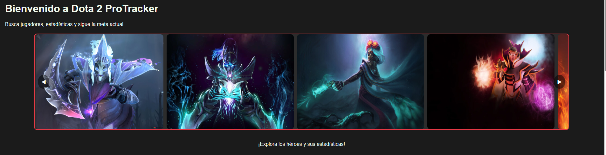
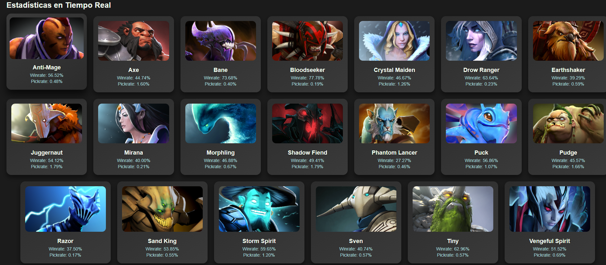
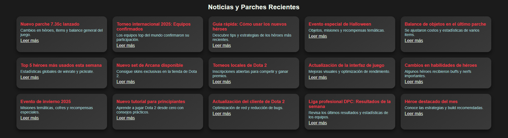
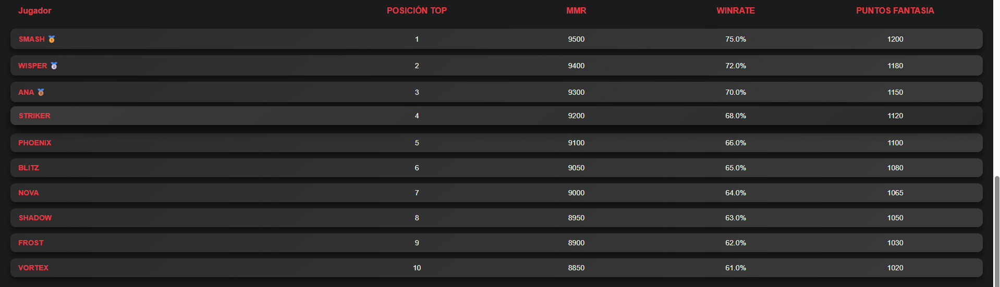
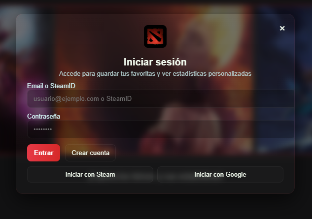
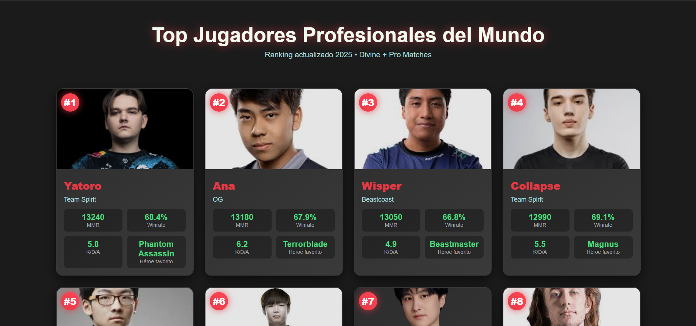
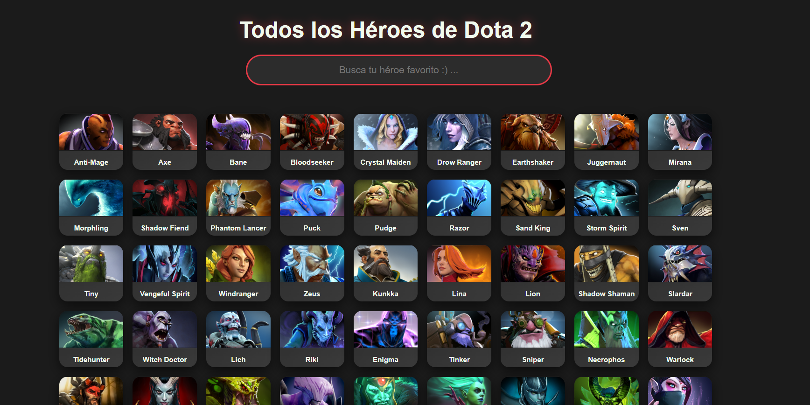
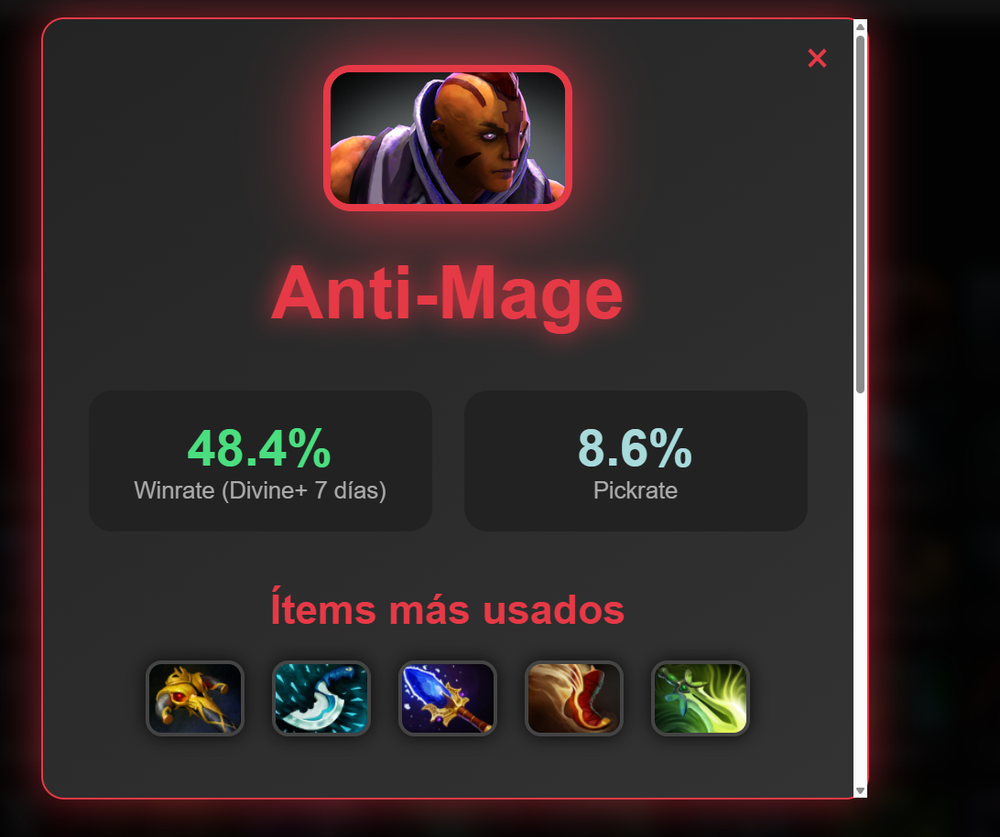

MANUAL DE USUARIO — Dota 2 Pro Tracker
1. Introducción

Dota 2 Pro Tracker es una página web informativa diseñada para jugadores que desean consultar estadísticas actualizadas de héroes, jugadores profesionales, objetos, tendencias del meta, noticias y videos relacionados con Dota 2.
Su objetivo es ofrecer una experiencia rápida, clara y visualmente atractiva para explorar datos útiles del juego.

2. Página de Inicio (Home)
2.1 Carrusel de héroes

En la parte superior encontrarás un carrusel de imágenes con héroes destacados.

2.2 Estadísticas generales

Debajo del carrusel puedes ver una vista rápida del winrate, popularidad y tendencias de los héroes más relevantes del meta actual.

2.3 Noticias de Dota 2

La sección de noticias muestra las últimas novedades del juego.
El botón “Ver noticias” redirige a la página oficial de Dota 2 en Steam.

2.4 Top jugadores del mundo

Sección alimentada mediante la API de openDota, muetra a los mejores juadores del mundo, con su MMR, WINRATE Y sus PUNTOS FANTASIA, los cuales son una valoracion interna dentro de la misma pagina

2.5 Videos recientes de Dota 2

Sección alimentada mediante la API de YouTube, mostrando videos actualizados relacionados con el juego.

3. Registro y Inicio de Sesión
3.1 Sign Up (Crear cuenta)

El usuario puede crear una cuenta ingresando:

Nickname

Correo electrónico

Contraseña

3.2 Login (Iniciar sesión)

Opciones disponibles (simuladas):

Iniciar sesión con Steam

Iniciar sesión con Google

Iniciar sesión con usuario registrado

4. Sección de Jugadores

Permite consultar:

MMR aproximado

Jugadores destacados

Estadísticas individuales

Información general del rendimiento del jugador

5. Sección de Héroes

Aquí puedes buscar tus héroes favoritos mediante tarjetas visuales.
Al seleccionar un héroe, se muestra:

Winrate actual

Héroes que lo counterean

Héroes con los que tiene mejor sinergia (team-up)

Builds y objetos más comunes

Tendencias del meta

Pick rate y ban rate

6. Navegación general

El usuario puede navegar entre secciones mediante el menú superior, accediendo a:

Inicio

Héroes

Meta

Jugadores

Ademas de:
gi
Ítems

Noticias

Videos

La navegación es directa e intuitiva para facilitar una experiencia fluida.

7. Consideraciones finales del proyecto

Dota 2 Pro Tracker es una versión inicial desarrollada para fines académicos en Programación Web 1. No incluye configuraciones avanzadas, perfiles personalizados ni opciones profundas de interacción, pero entrega información real, útil y actualizada mediante APIs públicas.
